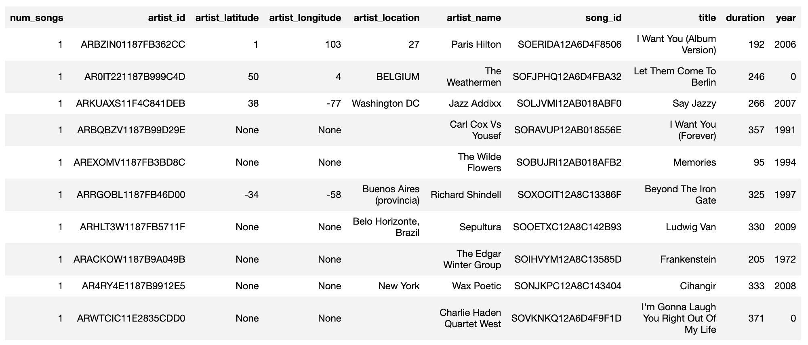
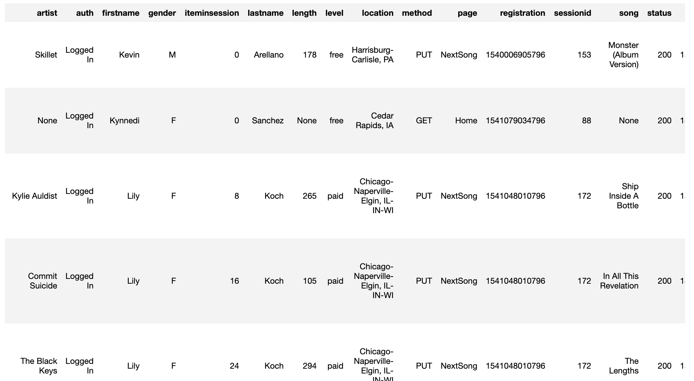
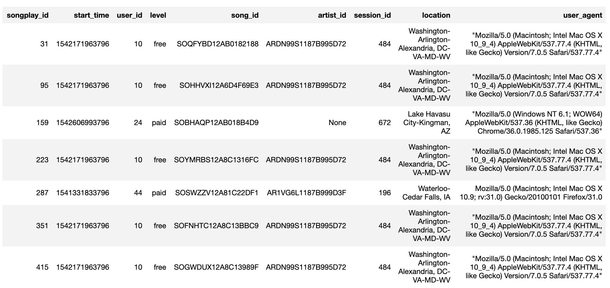
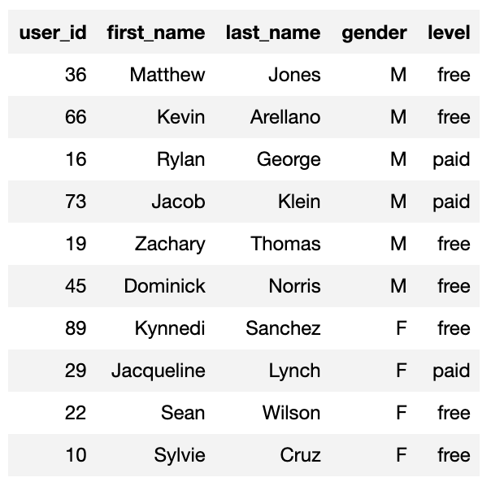
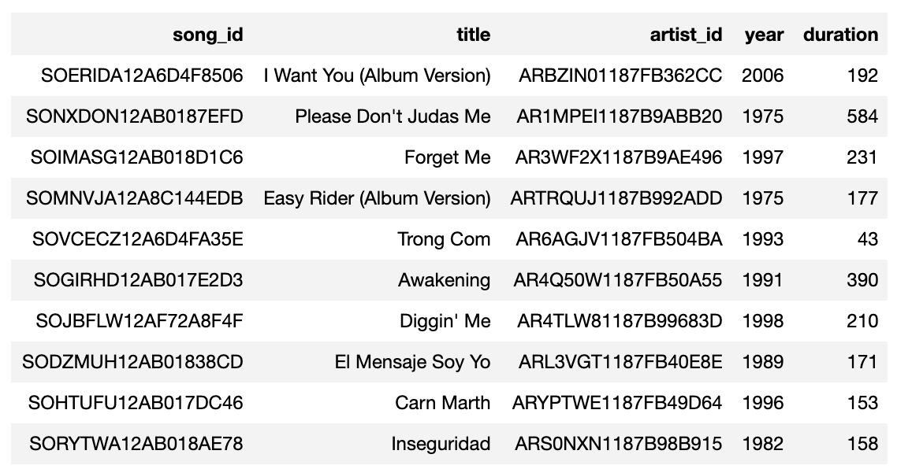
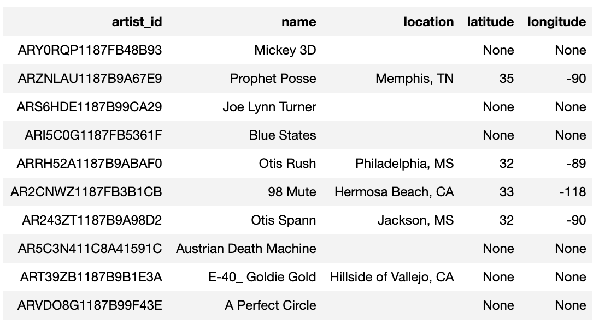
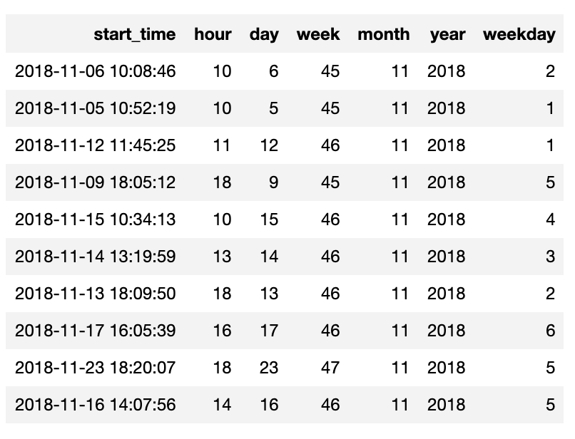

# Introduction

This project, proposed on Udacity's Data Engineering Nanodegree Program, consists in create a star schema optimzed for queries on song play analysis for a fictional company called Sparkify. The star schema helps their analytical goals assuming there are not a huge amount of data, therefore, it is possible to make joins among tables without performance issues.

# General Info

### Database Schema Design

The star schema has advantages for analytical purposes such as query performance and also it is easier to understand having each entity separated in a dimension table.

### ETL Process

It was given two kinds of files residing on S3's `udacity-dend` bucket:
- Inside a folder called `song_data` there are json files containing informations about songs and artists. Using the function `load_staging_tables` on `etl.py` script, I copied data from these json files to a staging table (`staging_songs`) on Amazon Redshift, resulting in the table below:


- Inside another folder called `log_data` there are json files with records of events a user can perform, also, there are information about the user and when the event happened. Using the same function mentioned above, I also copied data from these json files to a staging table on Amazon Redshift called `staging_events`, resulting in the table on the screenshot:


The data from the first staging table was organized in two dimensional tables: `songs` and `artists`. The data from the second was broke in other two dimensional tables: `users` and `time`. The fact table was created selecting data from `staging_events`, `songs` and `artists`, centralizing information as it should be.


### Tables on Sparkify database

It was created five tables through an ETL process:
- songplays (fact table)



- users



- songs



- artists



- time




# Running scripts

### create_tables.py
This script drops tables if they already exists and creates them again without records. It is possible to run it typing on terminal 
```
python3 create_tables.py
```

### etc.py
This script copies data from S3 and it populates staging tables `staging_songs` and `staging_events`. Then using queries from `sql_queries.py`, it selects data from staging tables and it inserts them on the 5 tables mentioned on *Tables on Sparkify database* section. It is possible to run it typing on terminal 
```
python3 etl.py
```
